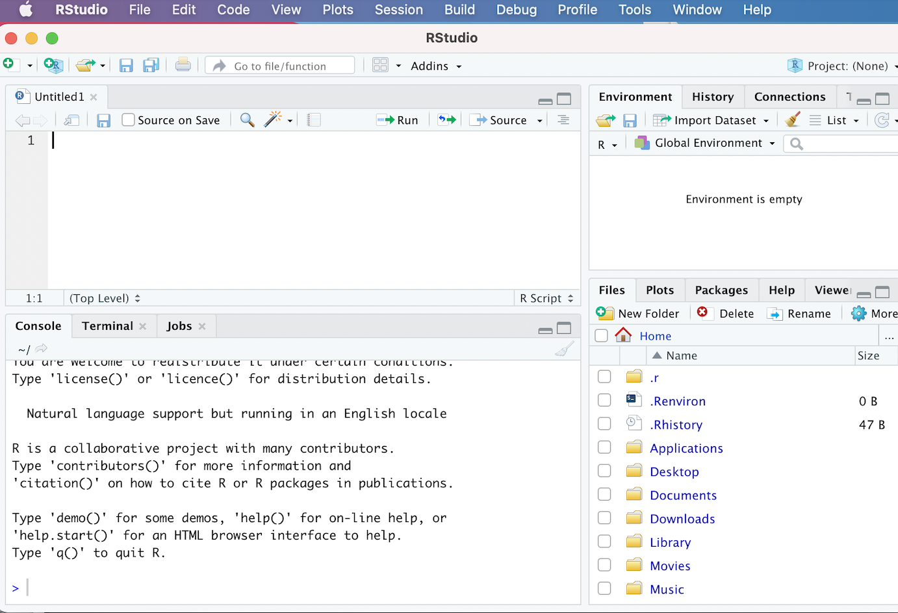

```{r}
#| echo: false
#| message: false
library(reactable)
```

# Introduction

This two-part workshop provides a general introduction to the R programming language, with a focus on carrying out common data-related tasks that come up in applied research across a variety of fields. It does not aim to provide a comprehensive overview of R's capabilities, which are vast; rather, the workshop's overarching goal is to help you cultivate basic proficiency in R, and develop a foundation for further exploration and self-study.

By the end of the workshop, you will be able to:

-   **Navigate the R Studio development environment** and i**nstall and load R packages** (Section 2)

-   **Explain and use basic features of the R language**, such as object assignment and common data structures (such as vectors, lists, and data frames) to organize and store data (Section 3)

-   **Write simple custom functions in R** that take input(s) and return output(s), and a**pply functions iteratively** to multiple values to streamline repetitive tasks (Section 4)

-   **Perform fundamental data wrangling and processing tasks** on real-world datasets (such as deleting or transforming variables, reshaping data, and combining multiple datasets) in preparation for analysis (Section 5)

-   **Conduct basic data analysis and create visualizations in R** to understand your data, and summarize and communicate insights to others (Section 6)

# Preliminaries and Set-Up

Before proceeding, please take some time to get set up so that you can actively follow along with the lesson on your own computers. It is necessary to install R and R Studio (if you haven't already), download the workshop data, and install relevant packages and load them into memory. The following sub-sections provide guidance on these tasks.

## Install R and R Studio

If you haven't already, please go ahead and install both the R and RStudio applications. R and RStudio must be installed separately; you should install R first, and then RStudio. The R application is a bare-bones computing environment that supports statistical computing using the R programming language; RStudio is a visually appealing, feature-rich, and user-friendly interface that allows users to interact with this environment in an intuitive way. Once you have both applications installed, you don't need to open up R and RStudio separately; you only need to open and interact with RStudio (which will run R in the background).

Please follow these [instructions](https://posit.co/download/rstudio-desktop/#download) to download R and R Studio; make sure you download the version of R appropriate for your operating system.

Once you've downloaded R and R Studio, go ahead and open R Studio, which will look something like this:

```{r}
#| echo: false
#| fig-cap: "The R Studio Interface"
#| label: fig-plot-1

```

Don't worry if your R Studio interface doesn't look exactly like this; we would expect to see minor cosmetic differences in the appearance of the interface across operating systems and computers (based on how they're configured). However, you should see four distinct windows within the larger RStudio interface:

-   The **top-left** window is known as the *Source* window.
    -   The *Source* window is where we can write our R scripts (including the code associated with this tutorial), and execute those scripts. We can also type in R code into the "Console" window (bottom-left window), but it is preferable to write our code in a script within the source window. That's because scripts can be saved (while code written into the console cannot); writing scripts therefore allows us to keep track of what we're doing, and facilitates the reproducibility of our work. Note that in some cases, we may not see a *Source* window when we first open RStudio. In that case, to start a new script, simply click the `File` button on the RStudio menu bar, scroll down to `New File` button, and then select `R Script` from the menu bar that opens up.
    -   It's also worth noting that the outputs of certain functions will appear in the *Source* window. In the context of our tutorial, when we want to view our datasets, we will use the `View()` function, which will display the relevant data within a new tab in the *Source* window.
-   The **top-right** window is the *Environment/History* pane of the RStudio interface.
    -   The "Environment" tab of this window provides information on the datasets we've loaded into RStudio, as well as objects we have defined (we'll talk about objects more later in the tutorial). -The "History" tab of the window provides a record of the R commands we've run in a given session.
-   The **bottom-right** window is the *Files/Plots/Packages/Help/Viewer* window.
    -   The "Files" tab displays our computer's directories and file structures and allows us to navigate through them without having to leave the R environment.
    -   The "Plots" tab is the tab where we can view any visualizations that we create. Within the "Plots" tab, make note of the "Zoom" button, which we can use to enlarge the display of our visualizations if they're too compressed in the "Plots" window. Also, note the "Export" button within the "Plots" tab (next to the "Zoom" button); we can use this button to export the displayed visualization to a .png or .jpeg file that can be used outside of RStudio.
    -   The "Packages" tab provides information on which packages have been installed, as well as which packages are currently loaded (more on packages below)
    -   The "Help" tab displays documentation for R packages and functions. If you want to know more about how a package or function work, we can simply type a "?" followed by the package or function's name (no space between the question mark and the name) and relevant information will be displayed within the "Help" tab.
    -   The "Viewer" tab displays HTML output. If we write code that generates an HTML file, we can view it within the "Viewer" tab.
-   The **bottom-left** window is the *Console/Terminal/Jobs* window.
    -   The "Console" tab is where we can see our code execute when we run our scripts, as well as certain outputs produced by those scripts. In addition, if there are any error or warning messages, they will be printed to the "Console" tab. We can also type code directly into the console, but as we noted earlier, it is better practice to write our code in a script and then run it from there.
    -   The "Terminal", "Jobs" tabs are not relevant for our workshop. We'll briefly provide an overview of "R Markdown" towards the end of the lesson.

## Download Data and Workshop Materials

In this workshop, we'll be working with a handful of real-world datasets. One of the datasets is a [cross-national dataset published](https://www.gu.se/en/quality-government/qog-data/data-downloads/basic-dataset) by the Quality of Government (QoG) Institute at the University of Gothenburg. The dataset (from January 2025) contains information on a variety of political, social, and economic variables from the early 2020s; additional [documentation](https://www.gu.se/en/quality-government/qog-data/data-downloads/basic-dataset) is available on the QoG's website. In addition, we'll work with several World Bank datasets downloaded from the [World Development Indicators](https://databank.worldbank.org/source/world-development-indicators).

Though you can download these data directly from these sources, they are also available on the Workshop's dedicated [repository](https://github.com/aranganath24/data_camp_R). Please download this repository to your computer by clicking the green "Code" button, and selecting the "Download ZIP" option. Alternatively, if you are already familiar with Github, you can also clone the repository via the command line. A third option is to download the repository directly by clicking the following [link](https://github.com/aranganath24/data_camp_R/archive/refs/heads/main.zip).

The data for the workshop is in the repository's "data" folder, and we'll read it into our R environment later in the lesson. The repository folder also contains other materials, which we'll introduce as necessary over the course of the workshop. For now, please go ahead and open the downloaded repository (which will be a folder named "data_camp_R", and double-click the file named "data_camp_r.Rproj". When you open this .Rproj file, a new workshop-specific R Studio environment should open.

At this point, please open the "workshop_script_empty.R" file by clicking **File** and then **Open File**, and selecting that file by navigating to the downloaded workshop repository. You can follow along with the lesson by typing our workshop code into this script.

This script is pre-populated with "comments"; in R, comments are always preceded by a "\#", which ensures that any text that comes after it will indeed be interpreted as a comment, rather than as code that must be executed. Code comments are be an essential way of documenting our work by explaining code in simple human-readable language. These comments allow us to communicate with others who might read our code, as well as our future selves.

When you begin writing your own R scripts, you should comment your code as you go. The "workshop_script_empty.R" file, however, contains pre-written comments; as we proceed through the workshop, you can write the relevant code immediately below the appropriate comment (remember to periodically save your script as you go). Note that the workshop directory also contains a fully populated script, named "workshop_script_complete.R", which contains both the comments and the code; you can use this completed script as a reference document, in case you get lost at any point.

## Install and load packages

Functions are essentially programs that apply an algorithm that transforms input(s) into outputs; they are akin to recipes that specify how ingredients (inputs) are to be combined and processed to create a meal (the output). As we will see, many functions come pre-programmed into R. However, R's native capabilities are significantly extended by a robust ecosystem of open-source user-written packages.

These R packages are essentially pre-written collections of functions organized around a given theme. One might think of packages as "cookbooks" of sorts, which contain a collection of different recipes (i.e. functions) united by some thematic thread. Packages are fundamentally a set of interrelated functions, but typically also contain other elements, such as data and documentation. One of the big advantages of using R is that it has a very large user community among social scientists, statisticians, and digital humanists, who frequently publish R packages, and thereby allow anyone who needs to accomplish the tasks to which the package addresses itself to use the package in the context of their own projects. The ability to use published packages considerably simplifies the work of applied data research using R; it means that we rarely have to write code entirely from scratch, and can build on the code that others have published in the form of packages. This allows applied researchers to focus on substantive problems, without having to get too bogged down in complicated programming tasks. Just as it is easier to make a meal with a cookbook (rather than deriving a recipe from scratch), it is easier to implement common data analysis tasks in R by using packages (rather than coding functions from scratch).

Over the course of the two-day workshop, we will use functions from a variety of packages:

-   The *tidyverse*, which is a suite of packages dedicated to various data analysis and visualization tasks

-   *fastDummies*, which makes it easy to transform categorical variables into binary indicator variables

-   *psych*, which (among other things) contains useful functions to generate tables of summary statistics

-   *stargazer*, which helps create publication-quality regression tables

To install a package in R, we can use the `install.packages()` function. In the code block below, the name of the package we want to install is enclosed within quotation marks and placed within parentheses after printing `install.packages`. Running the code below in your script will download the packages mentioned above to your computer. To run a code selection in an R script, you can highlight it and click the **Run** button in the R Studio menu bar. Alternatively, you can place the cursor on the line of code you'd like to run, and use a keyboard shortcut to run the code. On a Mac, the shortcut is clicking **Command** + **Shift** + **Return**. If you are using Windows, the keyboard shortcut to run the current line of code should be **Ctrl** + **Enter**.

```{r}
#| eval: false
# installs workshop packages
install.packages("tidyverse")
install.packages("fastDummies")
install.packages("psych")
install.packages("stargazer")
```

If you would like a more efficient way to install packages, we can pass the package names as a vector to the `install.packages()` function. Vectors, which we will discuss further below, are created using the `c()` function (the "c" stands for "combine"):

```{r}
#| eval: false
# installs workshop packages by passing a vector of package names # to the "install.packages()" function
install.packages(c("tidyverse", "fastDummies", "psych", "stargazer"))
```

At this point, the packages should be installed on your computers, but the packages are not yet ready for use. Before we can use our packages, we must load them into our current R environment. The process of loading installed packages into a current R environment is akin to opening up an application on your phone or computer after it has been installed. That is, even after an application has been installed, you can't use it until you open it. To load (i.e. "open") an R package, we pass the name of the package(s) we want to load as an argument to the `library()` function. Below, we load the packages we have installed into memory:

```{r}
#| message: false
# loads workshop packages into memory
library(tidyverse)
library(fastDummies)
library(psych)
library(stargazer)
```

At this point, these packages are loaded into memory and available for us to use. One important thing to note regarding the installation and loading of packages is that we typically only have to install packages once; after a package is installed, there is usually no need to subsequently reinstall it, so long as you don't make major changes to your R or R Studio applications. However, we must load the packages we need (using the `library()` function) every time we open a new R session. In other words, if we were to close RStudio at this point and open it up later, we would **not** need to install these packages again, but **would** need to load them into memory using the `library()` function again.

# The R Language

Our goal in this section is to learn some important principles and features of the R programming language; we won't attempt a comprehensive survey of the R programming language, but rather, emphasize key elements that will help you move quickly into applied data-based research. As you use R in your own research, you will inevitably learn more about the language itself.

We will discuss R as a calculator, and the concept of object assignment, but will spend most of our time learning about three fundamental data structures that you will use all the time when working on data-based research projects in R: vectors, data frames, and lists.

## R as a calculator

At its most basic level, R can be used as a calculator. For instance:

```{r}
# calculates 2+2
2+2
```

Now, let's try some more mathematical operations:

```{r}
# calculates 65 to the power of 4
65^4
```

```{r}
# calculates the sum of 24 and 4, divided by 7
(24+4)/7
```

```{r}
# calculates 2.78 subtracted from 10.453
10.453-2.78
```

While this is a useful and logical starting point, the possibility of assigning values to objects (or variables) considerably increases the scope of the operations we are able to carry out. We turn to object assignment in the next sub-section.

## Objects and Object Assignment

The concept of object (or variable) assignment is a fundamental concept when working in a scripting environment; indeed, the ability to easily assign values to objects is what allows us to easily and intuitively manipulate and process our data in a programmatic setting. To better understand the mechanics of object assignment, consider the following:

```{r}
# assign value 5 to new object named x
x <- 5
```

In the code above, we use R's assignment operator, `<-` (i.e. a left-pointing arrow) to assign the value 5 to an object named `x`. Now that an object named `x` has been created and assigned the value 5, printing `x` in our console (or printing `x` in our script and running it) will return the value that has been assigned to the `x` object, i.e. 5:

```{r}
# prints value assigned to "x"
x
```

More generally, the process of assignment effectively equates the output created by the code on the right side of the assignment operator (`<-`) to an object with a name that is specified on the left side of the assignment operator. Whenever we want to look at the contents assigned to an object (i.e. the output created by the code to the right side of the assignment operator), we simply print the name of the object in the R console (or print the name and run it within a script).

Let's create another object, named `y`, and assign it the value "12":

```{r}
# assign value 12 to new object named y
y <- 12
```

As we noted above, we can print the value that was assigned to `y` by printing the name of the object:

```{r}
# prints value assigned to "y"
y
```

Once objects are defined, it's possible to use those objects in arithmetic operations. For example:

Once objects are defined, it's possible to use those objects in arithmetic operations. For example:

```{r}
# prints the value of x + y
x+y
```

It's also possible to use existing objects to assign values to new ones. For example, we can assign the sum of `x` and `y` to a new object that we'll name `xy_sum`:

```{r}
# creates a new object, named "xy_sum" whose value is the sum of "x" and "y"
xy_sum <- x+y
```

Now, let's print the value of `xy_sum`that was created by the previous assignment operation:

```{r}
# prints value of of "xy_sum"
xy_sum
```

As expected, we see that the value assigned to `xy_sum` is "17" (i.e. the sum of the values assigned to `x` and `y`).

Thus far, we've been working with numeric values, but it's also possible to assign non-numeric contents to objects. For example, we can assign strings (i.e. lines of text) to objects. Below, consider the string "Boulder, CO" assigned to an object named `our_location:`

```{r}
# assigns string "Boulder, CO" to object named "our_location"
our_location <- "Boulder, CO"
```

We can print the string that has been assigned to the `our_location` object by typing the name of the object in our console, or running it from our script:

```{r}
# prints contents assigned to "our_location" object
our_location
```

While these examples are very simple, we can assign virtually any R code, and by extension, the data structure(s) generated by that code (such as datasets, vectors, graphs/plots, functions etc.) to an R object. When naming your objects, try to be descriptive, so that the name of the object signifies something about the code or outputs assigned to it.

When it comes to naming objects we have a lot of flexibility, but there are certain rules. For example:

-   Object names must start with a letter, and cannot contain any special symbols (they can only contain letters, numbers, underscores, and periods).

-   Object names cannot contain multiple unconnected words; if you'd like to use multiple words or phrases, connect the discrete elements with an underscore (`_`), or use camel case (where different words are distinguished by beginning each discrete word with a capitalized letter).

-   There are certain words that are "reserved" for other purposes, and therefore cannot be used in object names (i.e. `if`, `else`, `TRUE` , `FALSE`, etc).

It is also worth emphasizing that object names are case sensitive; in order to print the contents assigned to an object, that object's name must be printed *exactly* as it was created. For example, if we were to type `our_Location`, we would get an error, since there is no `our_Location` object (only an `our_location` object):

```{r}
#| error: TRUE
# prints contents of "our_Location"; demonstrates case-sensitivity
our_Location

```

In order to keep track of the objects we have created, we can use the handy `ls()` function, which will print the names of all the objects that are in memory:

```{r}
# prints objects in memory
ls()
```

To delete an object from memory, youwecan pass it to the `rm()` function. For example, the following will delete the `our_location` object from memory:

```{r}
# deletes "our_location" object from memory
rm(our_location)
```

Now, we can confirm that the `our_location` object has indeed been deleted by running `ls()` once again:

```{r}
# prints objects in memory
ls()
```

## Data Structures

We now turn to a brief overview of some important data structures that help us to work with data in R. We will consider three data structures for organizing and storing data that are particularly useful: vectors, data frames, and lists. Note that this is not an exhaustive treatment of data structures in R; there are other structures, such as matrices and arrays, that are also important, and which you may encounter or use in your future work. However, for now, we will limit our discussion to vectors, data frames, and lists, since they are the data structures that are essential for getting started with applied research in R, and the data structures that you will likely use most frequently.

### Vectors

In R, a vector is a sequence of values of the same type (i.e. we can have a sequence of numbers or a sequence of strings, but cannot mix and match types in a vector).

A vector is created using the `c()` (combine) function, which is programmed into base R (i.e. it's not from an external package). For example, let's make a vector of numeric values, which we will take to represent the temperatures (in Celsius) of some cities in Asia. The `c()` function takes as its input a series of numbers, and returns as its output a numeric vector with those numbers as elements:

```{r}
# makes vector with values 32, 18, 41, 11
c(32, 18, 41, 11)
```

Recall that we can assign vectors to objects with descriptive names. Let's create a new vector object named `asia_temperatures_celsius` to store these values:

```{r}
# assigns vector of temperatures from Asian cities to a new object named "asia_temperatures_celsius"
asia_temperatures_celsius<-c(32, 18, 41, 11)
```

Now, whenever we want to print the vector assigned to the `asia_temperatures_celsius` object, we can simply print the name of the object:

```{r}
# prints contents of "asia_temperatures_celsius"
asia_temperatures_celsius
```

Though we have focused so far on numeric vectors (i.e. vectors where the elements are numbers), it is also possible to create vectors where the elements are strings (i.e. text). For example, let's create a vector that contains the names of cities that have a University of Colorado campus, and assign it to an object named `university_of_colorado_locations`

```{r}
# defines new vector assigned to object named "university_of_colorado_locations" that contains locations of CU campuses
university_of_colorado_locations<-c("Boulder", "Denver", "Colorado Springs")
```

Now let's print out its contents:

```{r}
# prints contents of "university_of_colorado_locations"
university_of_colorado_locations
```

It is often helpful to add text labels to vectors (particularly numeric vectors), which can provide important context that helps us to keep track of the information stored within a vector. Let’s return to the `asia_temperatures_celsius` vector we created above and imagine that the first element in the vector represents the temperature for Mumbai; the second element represents the temperature in Hanoi; the third represents the temperature in Singapore; and the fourth represents the temperature in Beijing. We can country labels to `asia_temperatures_celsius` with the following:

```{r}
# assigns labels to temperatures values in "asia_temperatures_celsius"
names(asia_temperatures_celsius)<-c("Mumbai", "Hanoi", "Singapore", "Beijing")
```

Now, let’s view the contents of `asia_temperatures_celsius`, and note that the numeric values are labelled:

```{r}
# prints "asia_temperatures_celsius" (note labels)
asia_temperatures_celsius
```

Alternatively, it's also possible to use "inline" naming, in which vector elements are labelled as the vector is created. Below, we create a vector of temperatures in some major North American cities in Celsius using inline naming:

```{r}
# creates new vector of temperatures in Celsius of major North American cities with labels created using inline naming
north_america_temperatures_celsius<-c("New York City"=25, "Toronto"=15, "Mexico City"=8.5, "Vancouver"=10, "Boston"=12.5)
```

Let’s print the contents of the newly created `north_america_temperatures_celsius` vector:

```{r}
# prints contents of "north_america_temperatures_celsius"
north_america_temperatures_celsius
```

In many cases, it is useful to subset a vector, and extract specific element(s) from it. Each element in a given vector is assigned an index number, starting with 1; that is, the first element in a vector is assigned an index value of 1, the second element of a vector is assigned an index value of 2, and so on. We can use these index values to extract our desired vector elements. In particular, we can specify the desired index within square brackets after printing the name of the vector object of interest. For example, let’s say we want to extract the 3rd element of the vector in `asia_temperature_difference_celsius`. We can do so with the following, which returns the temperature value for Singapore, the third element in `asia_temperature_difference_celsius`:

```{r}
# Extracts the third element from the "asia_temperatures_celsius" vector
asia_temperatures_celsius[3]
```

In some cases, we may want to extract more than one vector element. We can conveniently extract a range of vector elements using their index values. For example, let’s say we want to extract a new vector comprised of the first, second, and third numeric elements in `asia_temperatures_celsius`; we can do so with the following:

```{r}
# Extracts elements 1 through 3 in the "asia_temperatures_celsius" and deposits these elements in a new vector
asia_temperatures_celsius[1:3]
```

Sometimes, we may want to subset our vectors by referencing non-consecutive elements. For example, instead of extracting the first through third elements of the `asia_temperatures_celsius` vector, perhaps we only want to extract the first and third elements, without also extracting the second. Intuitively, we could try the following:

```{r}
#| error: true
# tries to extract the first and third elements from "asia_temperatures_celsius" and deposit them into a new vector
asia_temperatures_celsius[1,3]
```

However, as you can see, this syntax throws an error. Instead, if we want to extract non-continuous elements from a vector, we have to pass the index numbers into their own vector, and enclose this vector of index numbers in square brackets. For example, to extract only the first and third elements from `asia_temperatures_celsius`, we would pass the index numbers of the elements we want to extract as a vector to the square brackets:

```{r}
# extracts the first and third elements from "asia_temperatures_celsius" and deposits them into a new vector
asia_temperatures_celsius[c(1,3)]
```

We can also use negative index numbers to subset vectors; in particular, while passing a positive index number will extract the vector element that corresponds with that number and creates a new vector with that subsetted element, passing a negative index number will return a vector that deletes the element that corresponds to the the absolute value of the negative index number. For example, the following removes the temperature associated with Hanoi (the second element in `asia_temperatures_celsius`) and returns a new vector with the remaining temperatures:

```{r}
# removes second element in "asia_temperatures_celsius" vector and returns a vector with the remaining values
asia_temperatures_celsius[-2]
```

When working with labelled vectors, it's also possible to extract desired element(s) with the label, rather than the index number. For example, instead of extracting Singapore’s temperature with its corresponding index value of three, we can do so with the city label enclosed in quotation marks:

```{r}
# Extracts the third element from the "asia_temperatures_celsius" vector using its label
asia_temperatures_celsius["Singapore"]
```

One of R's most useful features (which makes it especially powerful and intuitive in the context of data analysis), is that it is designed to perform operations on entire vectors without the need for loops (a programming construct used to perform operations across multiple elements). A scalar operation applies one operation to all the elements of a vector. For example, let’s say that something went wrong in the transcription of temperatures, and all of the temperatures in `asia_temperatures_celsius` are understated by two degrees. We can add two to each element in the `asia_temperatures_celsius` vector, and thereby fix the error, with the following scalar operation:

```{r}
# adds two to each element of "asia_temperatures_celsius" vector
asia_temperatures_celsius+2
```

Of course, the above operation did not permanently add two to all of the elements in `asia_temperatures_celsius`, since we did not overwrite the existing vector by assigning the changes back to the object. We can do so with the following:

```{r}
# adds two to each element of "asia_temperatures_celsius" vector and assigns the changes back to the object
asia_temperatures_celsius<-asia_temperatures_celsius+2
```

In element-wise operations, arithmetic operations are carried out with more than one vector (i.e. adding two vectors together). For example, let's first create two toy vectors, a and b:

```{r}
# creates two new vectors assigned to objects "a" and "b"
a<-c(5,6,22)
b<-c(7,12,3)
```

Now, if we add these two vectors together, the resulting vector will look as follows:

```{r}
# adds vectors a and b
a+b
```

That is, the first element of the resulting vector is the sum of the first elements in a and b; the second element is the sum of the second elements of a and b; and so on.

Element-wise operations are straightforward when vectors are of equal length. What happens when vectors are of unequal length? Consider the following example, where we have two vectors, `c` and `d`, of unequal length:

```{r}
# creates two new vectors, "a" and "b" of unequal length
c<-c(3,5,7)
d<-c(6,12,3,5)
```

When we add the two vectors, the resulting vector looks as follows:

```{r}
# adds vectors c and d
c+d
```

The first three element-wise operations are straightforward: 3+6=9, 5+12=17, and 7+3=10. However, `c` does not have a fourth element, but `d` does; how is this handled? In short, the shorter vector is "recycled" (i.e. repeated) to match the length of the longer one. In this case, once we hit the end of `c` the recycling process goes back to the beginning, takes the element "3", and uses it as the fourth element in the vector, which can be added to the fourth element of `d` to yield "8" as the fourth element in the resultant `c+d` vector.

Let's now slightly tweak this scenario by adding another element, "6", to vector `d` :

```{r}
# adds 6 as 5th element of "d"
d<-c(d, 6)
```

Vector `d` now contains five elements:

```{r}
# prints updated vector d
d
```

What do you think happens when we carry out `c+d` now? In particular, what do you think are the fourth and fifth elements of `a+b`? The principle of vector recycling suggests that the fourth element will be 8 (3+5), while the fifth element will be 11 (5+6):

```{r}
# prints c+d
c+d
```

Being aware of this property of vectors in R can be helpful in troubleshooting errors or unexpected behavior once you're working with real-world data in R.

Finally, it's important to note that it's also possible to carry out vectorized operations on character vectors that are somewhat analogous to the mathematical operations carried out on numeric vectors. To illustrate one useful example, let's first create two new character vectors:

```{r}
# creates vector of university names
university_names<-c("University of Colorado, ", "Colorado State University, ")

# creates vector of locations
locations<-c("Boulder", "Fort Collins")
```

Now, we'll use the `paste()` function to carry out an element-wise concatenation of the strings in these two vectors; we'll assign the resulting vector of concatenated strings to a new object named `university_name_location`:

```{r}
# uses paste0 function to paste the strings in "university_names" and "locations" together in element-wise fashion and assign the resulting character vector to "university_name_location"
university_name_location<-paste0(university_names, locations)
```

Let's go ahead and print the contents of `university_name_location`:

```{r}
# prints contents of "university_name_location"
university_name_location
```

Vectorized operations with the `paste0()` can be very useful in creating names for objects and file names when working in applied settings, as we will see later in the workshop.

### Data Frames

The data frame structure is the workhorse of data analysis in R. A data frame resembles a table, of the sort you might generate in a spreadsheet application.

Often, the most important (and arduous) step in a data analysis workflow is to assemble disparate strands of data into a tractable data frame. What does it mean for a data frame to be “tractable”? One way to define this concept more precisely is to appeal to the concept of “tidy” data, which is [often referenced in the data science world](https://vita.had.co.nz/papers/tidy-data.pdf). Broadly speaking, a “tidy” data frame is a table in which:

1.  Each variable has its own column

2.  Each observation has its own row

3.  Each value has its own cell

We will work extensively with data frames later in the workshop, but let’s generate a toy data frame from scratch, and assign it to a new object. We will generate a data frame containing made up country-level data on basic economic, geographic, and demographic variables, and assign it to a new object named `country_df`. The data frame is created through the use of the `data.frame()` function, which has already been programmed into R. Column names and the corresponding column values are passed to the `data.frame()` function in the manner below, and the function effectively binds these different columns together into a table:

```{r}
# Creates a toy country-level data frame 
country_df<-data.frame(Country=c("Country A", "Country B", "Country C"),
                       GDP=c(8000, 30000, 23500),
                       Population=c(2000, 5400, 10000),
                       Continent=c("South America", "Europe", "North America"))
```

To observe the structure of the table, we can print it to the R console by simply printing the name of the object to which it has been assigned:

```{r}
# prints "country_df" data frame to console
country_df
```

One nice feature of R Studio is that instead of simply printing our data frames into the console, we can view a nicely formatted version of our data frame by passing the name of the data frame object through the `View()` function. For example, the code below will bring up the `country_df` data frame as a new tab in R Studio:

```{r}
#| eval: false
# pulls up "country_df" data frame in R Studio data viewer
View(country_df)
```

```{r}
#| echo: false
reactable(country_df,
          searchable=FALSE,
          filterable=FALSE,
          bordered=TRUE,
          striped=TRUE)
```

Note the “tidy” features of this simple data frame:

1.  Each of the variables (i.e. GDP, Population, Continent) has its own column

2.  Each of the (country-level) observations has its own row

3.  Each of the values (i.e. country-level information about a given variable) has its own distinct cell

Let's now turn to a brief exploration of how to extract rows and columns from a data frame, using principles of indexing similar to what we learned in the context of working with vectors. Since data frames are the workhorse of social scientific research in R, we'll spend considerably more time on data frames in future lessons; for now, we just want to get acquainted with some basic base R syntax that allows us to get started.

Unlike vectors, data frames are two dimensional; that is, they have both rows and columns. Both rows and columns are assigned index numbers; the convention is to refer to the index number of rows first, followed by the index number for columns. We can reference index numbers within square brackets to extract rows, columns, or observations from a data frame.

For example, the following extracts the first row of `country_df` and all columns:

```{r}
# extracts entire first row and all colums from "country_df"
country_df[1, ]
```

Alternatively, if we want to extract a specific column along with all rows, we leave the row index blank, and specify the index of the column we want to extract. For example, the following extracts the entire third column:

```{r}
# extracts entire third column and all frows from "country_df"
country_df[, 3]
```

We can extract a cell by specifying both a row and column index. For example, the following extracts the population of Country B:

```{r}
# extracts population of Country B
country_df[2, 3]
```

It is also possible to extract multiple columns and rows. If we want to extract consecutive columns/rows, we can simply separate the starting and ending index values for the desired rows or columns with a colon. For example, the following extracts the second through third rows from `country_df`:

```{r}
# extracts second and third rows from "country_df"
country_df[2:3, ]
```

The following extracts the second through third columns:

```{r}
# extracts second and third columns from "country_df"
country_df[, 2:3]
```

To extract non-consecutive rows/columns, we specify the relevant index numbers within a vector. For example, the following extracts rows 1 and 3 from `country_df`:

```{r}
# extracts first and third rows from "country_df"
country_df[c(1,3), ]
```

The following extracts columns 1 and 3 from `country_df`:

```{r}
# extracts first and third columns from "country_df"
country_df[, c(1,3)]
```

We can combine these rules in flexible ways to extract the precise data we're interested in. For example, the following extracts the first and second rows, and the first, second, and fourth columns, from `country_df`, and assigns the subsetted data frame to a new object named `dataset_selection`:

```{r}
# extracts the first and second rows, and first, second, and fourth columns from "country_df"; assigns resulting data frame to a new object named "dataset_selection"
dataset_selection<-country_df[1:2, c(1,2,4)]
```

When we print `dataset_selection`, it looks as expected:

```{r}
# prints "dataset_selection"
dataset_selection
```

Before proceeding, it's worth noting a convenient way to extract columns from a data frame, which we will often encounter when working with R. In particular, we can extract a column from a data frame by typing the name of the data frame object, followed by the dollar sign (\$), followed by the name of the column we want to extract. For example, let's say we want to extract the "Continent" column from `country_df`:

```{r}
# extracts "Continent" column from "country_df" using dollar sign notation
country_df$Continent
```

The columns that comprise data frames are vectors, so when we extract a column, the resulting object is a vector. We will confirm this below, when we discuss the concept of data classes, which are closely related to data structures.

### Lists

In R, a list is a data structure that allows us to conveniently store a variety of different objects, of various types. For example, we can use a list to vectors, data frames, visualizations and graphs–basically any R object you can think of! It is also possible to store a list within a list.

Lists allow us to keep track of the various objects we create, and are therefore a useful data management tool. In addition, lists are very helpful to use when we want to perform iterative operations across multiple objects.

We can create lists in R using the `list()` function; the arguments to this function are the objects that we want to include in the list. In the code below, we’ll create a list (assigned to an object named `example_list`) using the `list()` function. It contains some of the objects we create earlier in the lesson: the numeric `asia_temperatures_fahrenheit` vector, the `university_name_location` character vector, the `country_df` data frame, and the selection from `country_df`, `dataset_selection`, which is also a data frame.

```{r}
# creates list whose elements are the "asia_temperatures_celsius" numeric vector, the "university_name_location" character vector, and the "country_df" and "dataset_selection" data frames, and assigns it to a new object named "example_list"
example_list<-list(asia_temperatures_celsius, university_name_location, country_df, dataset_selection)
```

Now that we’ve created our list object, let’s print out its contents:

```{r}
# prints contents of "example_list"
example_list
```

As you can see, our list contains each of the various specified objects within a single, unified structure. We can access specific elements within a list using the specific index number of the desired element, in much the same way we did for vectors. When extracting a single list element from a list, the convention is to enclose the index number of the desired list element in double square brackets. For example, if we want to extract the country-level data frame from `example_list`, we can use the following:

```{r}
# extracts third element from "example_list"
example_list[[3]]
```

If we want to subset a list, and extract more than one list element as a separate list, we can do so by creating a vector of the index values of the desired elements, and enclosing it in single brackets after the name of the list object. For example, if we wanted to generate a new list that contained only the first and third elements of `example_list` (the numeric vector of arbitrary values and the data frame), we would use the following syntax:

```{r}
# extracts first and third elements from "example_list"
example_list[c(1,3)]
```

If, instead, we want to extract consecutive elements, we don't have to use a vector; we can simply specify the starting and ending index values, separated by a colon. For example, the following extracts the first through third elements from `example_list`:

```{r}
# extracts first through third elements from "example_list"
example_list[1:3]
```

While list elements are not automatically named, we can name our list element using the `names()`function. The first step is to define a character vector of desired names. We can specify any names we’d like but for the sake of illustration, let’s say we want to name the first list element “element1”, the second list element “element2”, and so on. Let’s create a vector of our desired names, and assign it to an object named `name_vector`:

```{r}
# creates a character vector of desired names for list elements, and assigns it to a new object named "name_vector"
name_vector_list<-c("element1", "element2", "element3", "element4")
```

Now, we’ll assign these names in `name_vector` to the list elements in `example_list` with the following:

```{r}
# assigns names from "name_vector" to list elements in "example_list"
names(example_list)<-name_vector_list
```

Let’s now print the contents of `example_list`:

```{r}
# prints contents of "example_list"
example_list
```

Note that the list elements now have names attached to them; the first character string in `name_vector`is assigned as the name of the first element in `example_list`, the second character string in `name_vector` is assigned as the name of the second element in `example_list`, and so on.

Practically speaking, we can now extract list elements using the assigned names. For example, if we want to extract the data frame from `example_list`, we could do so by its assigned name (“element3”), as follows:

```{r}
# Extracts the data frame from "example_list" by its assigned name
example_list[["element3"]]
```

Note that even after assigning names to list elements, you can still extract elements by their index value, if you would prefer to do so:

```{r}
# Extracts the "element3" data frame from "example_list" by its index number
example_list[[3]]
```

Finally, it's worth noting that we can also use inline labeling to name list elements (as we did for vectors above).

## Data Classes

We're done with our tour of three fundamental data structures in R, which we will repeatedly use in our work as applied social scientists: vectors, data frames, and lists. Data structures are essentially containers for storing and organizing data in well-defined and organized ways, and R functions interact with object differently based on their underlying structure. An object's "class" provides additional information about how it behaves. The class of an object generally corresponds to the object's data structure (for example, the "data.frame" class is often associated with the data frame data structure), but the class of an object can also extend functionality, and customize how an object interacts with R. For example, "tibbles" are a type of enhanced data frame that are used in the *tidyverse*, and tibbles have the class "tbl_df"

We can retrieve the class of an object (i.e. extract information about whether an object behaves as a data frame, vector, list, or some other structure) by passing the name of the object as an argument to the `class()` function. For example, let's say we want to confirm the class of `example_list`:

```{r}
# prints class of "example_list"
class(example_list)
```

As expected, `example_list` belongs to the class "list".

Let's consider another:

```{r}
# prints class of "asia_temperatures_fahrenheit"
class(asia_temperatures_celsius)
```

As expected, given how we created it, `asia_temperatures_celsius` is of the class "numeric", i.e. a numeric vector.

Let's retrieve the class of `country_df:`

```{r}
# prints class of "country_df"
class(country_df)
```

Sometimes, we will need to transform objects into a different class than the one they are currently assigned. For example, let's say that a function we'd like to use can take a data frame input, but doesn't accept vector inputs. In that case, if our data is stored as a numeric vector, we must convert the object to a data frame before passing it to the desired function. Let's say the numeric vector data we want to convert to a data frame is `asia_temperatures_celsius.` We can do so by passing it to the `as.data.frame()` function which converts objects of different classes to the "data.frame" class. We'll assign the data frame version of `asia_temperatures_celsius` to a new object named `asia_temperatures_df` and print its contents:

```{r}
# converts "asia_temperatures_celsius" to data frame class and assigns the data frame to a new object named "asia_temperatures_df"
asia_temperatures_df<-as.data.frame(asia_temperatures_celsius)

# prints contents of "asia_temperatures_df"
asia_temperatures_df
```

We can confirm the new class of `asia_temperatures_df` with the following:

```{r}
# prints class of "asia_temperatures_df"
class(asia_temperatures_df)
```

We could carry out the inverse operation (i.e. transforming an object of the "data.frame" class to an object of class "numeric") by passing the data frame object to the `as.numeric()` function. There are several functions that allow for class transformations such as this. Classes may feel confusing now, but they will become more intuitive as you work in R. They are important to be aware of, especially in the context of trouble shooting and debugging, since functions often don't work as expected when they expect arguments of one class but receive another.

# Functions and Iteration

Given the enormous variety and sophistication of the R package ecosystem, you will not have to become an expert programmer to work with data in R; rather, you can draw on the functions others have written to implement virtually any data-related task you could imagine. However, developing a basic understanding of how to write your own functions is nevertheless important, for a variety of reasons:

-   Sometimes, there won't be a convenient pre-programmed function available to accomplish a given task, which will require you to write your own custom function.
-   Writing your own functions will allow you to automate your workflows
-   Writing functions will allow you to write more concise and readable code.

With those considerations in mind, learn a little bit about how to write some simple functions of our own. We'll also learn more about how to use functions from the *purrr* package (part of the *tidyverse* suite) to iteratively cycle multiple input values through our functions, which can help to automate various data processing workflows. In other words, iteration is the process of sequentially applying a function to multiple inputs (typically contained in a vector, list, or data frame); it is a key part of functional programming that can save you enormous amounts of time and energy.

## Custom Functions

The best way to learn how functions (whether those in base R, or from external packages) work is to develop our own. To that end, we'll now learn how to write some simple functions, and develop some intuition for how they are put together. Writing your own functions can be challenging, so we'll develop our intuition by starting with a very simple example. In particular, we begin by writing a one-argument function, before turning to writing a two-argument function. It is straightforward to generalize these cases to the process of writing functions with more than two inputs, and you are encouraged to attempt this as an exercise.

### Single-input functions

Let's say we have a large collection of temperature data, measured in Fahrenheit, and we want to convert these data to Celsius. Recall that the formula to convert from Fahrenheit to Celsius is the following, where "C" represents temperature in Celsius, and "F" represents temperature in Fahrenheit:

```{r}
#| eval: FALSE
# fahrenheit to Celsius formula, where C is Celsius output and F is Fahrenheit input
(F-32)*(5/9)=C
```

As we discussed before, at its most basic level, R is a calculator; if for example, one of our Fahrenheit measurements is 55 degrees; we can convert this to Celsius by plugging 55 into the conversion formula:

```{r}
# Converts 55 degrees fahrenheit to Celsius
(55-32)*(5/9)
```

This is easy enough, but if we have a large amount of temperature data that requires processing, we wouldn’t want to carry out this calculation for each measurement in our data collection. The first step in allowing us to carry out this conversion operation at scale is to write a function. Let’s see how we can wrap the Fahrenheit-Celsius formula above into a function:

```{r}
# creates fahrenheit to celsius conversion function and assigns it to a new object named "fahrenheit_to_celsius_converter"
fahrenheit_to_celsius_converter<-function(fahrenheit_input){
  celsius_output<-(fahrenheit_input-32)*5/9
  return(celsius_output)
}
```

Let’s unpack the code above, which we used to create our function:

-   We declare that we are creating a new function with the word `function`; within the parenthesis after `function`, we specify the function’s argument(s). Here, the function’s argument is an input named `fahrenheit_input`. The name of the argument(s) is arbitrary, and can be anything you like; ideally, its name should be informed by relevant context. Here, the argument/input to the function is a temperature value expressed in degrees Fahrenheit, so the name “fahrenheit_input” describes the nature of this input.

-   After enclosing the function’s arguments within parentheses, we print a right-facing curly brace `{`, and then define the body of the function (i.e. the recipe), which specifies how we want to transform this input. In particular, we take`fahrenheit_input`, subtract 32, and then multiply by 5/9, which transforms the input to the celsius temperature scale. We’ll tell R to assign this transformed value to a new object within the function, named `celsius_output`. Objects defined within a function are treated differently than objects defined outside of it; we'll return to this topic at the end of the session, but this is worth flagging and keeping in mind right now.

-   In the function’s final line, `return(celsius_output)`, we specify the value we want the function to return. Here, we are saying that we want the function to return the value that was assigned to `celsius_output`. We then close the function by typing a left-facing curly brace below the return statement `}`.

-   Just as we can assign data or visualizations to objects that allow us to subsequently retrieve the outputs of our code, so too with functions. Here, we’ll assign the function we have just written to an object named `fahrenheit_to_celsius_converter`.

After running that code, we can use the newly created `fahrenheit_to_celsius()` function to perform our Fahrenheit to Celsius transformations. Let’s say we have a Fahrenheit value of 68, and want to transform it to Celsius:

```{r}
# tests function using an input of 68 degrees fahrenheit
fahrenheit_to_celsius_converter(fahrenheit_input=68)
```

Above, we passed the argument `fahrenheit_input=68` to the `fahrenheit_to_celsius_converter()` function that we created; the function then took this value (68), plugged it into “fahrenheit_input” within the function and assigned the resulting value to “celsius_output”; it then returned the value of “celsius_output” (20) back to us. Note that while it's good practice to label one's arguments (it can help avoid confusion, especially as we move into more complex functions with multiple inputs), it isn't strictly necessary. For example, we could just enter a numeric argument for the temperature input, and the function will work:

```{r}
# uses "fahrenheit_to_celsius_converter" function using an input of 20 degrees fahrenheit
fahrenheit_to_celsius_converter(22)
```

In short, we can specify any value for the “fahrenheit_input” argument; this value will be substituted for “fahrenheit_input” in the expression `celsius_output<-(fahrenheit_input-32)*(5/9)`, after which the value of `celsius_output` will be returned to us.

### Double-input functions

Let's extend what we learned above by writing a function that takes two arguments, rather than one. The principles are the same. To see this, let's define a function that takes export and import values as arguments, and returns a value for net exports (defined as the difference between total exports and total imports). Below, we assign this function to an object named `net_exports_calculation()`:

```{r}
# writes function that takes export and import values as inputs, and returns a value for net exports; function is assigned to a new object named "net_exports_calculation"
net_exports_calculation<-function(exports, imports){
  net_export_value<-exports-imports
  return(net_export_value)
}
```

In essence, the function has two arguments, "exports" and "imports" that are supplied by the user; the body of the function takes these arguments, and subtracts the supplied value of imports from exports, and assigns this result to the object `net_export_value`, which it then returns as the output. Let's go ahead and test the function:

```{r}
# tests the "net_exports_calculation" function in a case where exports are 133, and imports are 55
net_exports_calculation(exports=133, imports=55)
```

The function works as expected. Note that if we switch the order in which we supply the arguments, the function continues to work as expected, so long as we label the arguments:

```{r}
# tests the "net_exports_calculation" function in a case where exports are 133, and imports are 55; reverses order in which inputs are supplied
net_exports_calculation(imports=55, exports=133)
```

However, if the arguments are not labelled, the order in which they are supplied does matter. That is, if the arguments are not labelled, the function assumes that they are passed in the order they're defined in the function; in this case, that means that the assumption is that the first argument is the import argument and the second is the export argument. So, the following presumes that exports are 55, and imports are 133:

```{r}
# tests the "net_exports_calculation" function in a case where exports are 55, and imports are 133; does not explicitly label inputs, order matters
net_exports_calculation(55, 133)
```

And the following presumes the opposite, that exports are 133, and imports are 55.

```{r}
# uses the "net_exports_calculation" function in a case where exports are 133, and imports are 55; does not explicitly label inputs, order matters
net_exports_calculation(133, 55)
```

## Iteration

Now that we have a sense of how to write basic functions, let's now turn to the concept of iteration, which is fundamentally about cycling multiple sets of inputs through a function in sequential fashion. These inputs are typically stored as elements in a vector or list. Functions and iteration are thus closely related; functions are small programs that perform some action, while iteration applies those programs repeatedly across several inputs.

For example, we already have a function to convert Fahrenheit temperature values to Celsius temperature values; using this newly created function helps us to avoid manually converting each of our temperature values from the Fahrenheit scale to the Celsius scale. Instead of repeating the full calculation over and over manually, we could simply plug our Fahrenheit temperature values into the function, and let the function carry out the calculation for us. However, it is still time-consuming to plug our Fahrenheit values into the function one-by-one. Instead, we could deposit our Fahrenheit temperature values into a vector, iteratively (i.e. sequentially) run these input values through our function, and deposit the output values as elements of a new object (such as a list, vector, or data frame).

Typically, in programming languages, input values are iteratively cycled through functions using a construct known as a for-loop, which some of you may already be familiar with. R users frequently use specialized functions (instead of for-loops) to iterate over input values; this functional approach to iteration is often faster, or at the very least, makes R scripts more readable. One family of these iterative functions is the “Apply” family of functions. A more recent set of functions that facilitate iteration is part of the *tidyverse*, and is found within the [purrr](#0) package. These functions are known as `map()` functions, and we will use them in this lesson to iterate our functions across multiple input values.

There are many different kinds of `map()` functions within the *purrr* package, two of the fundamental map functions, which we will emphasize, are `map()`, which iterates over input values stored as elements of a vector or list, and deposits the output values as elements in a list, and `map_dbl(),` which iterates over input values stored as elements of a vector or list, and deposits the output values in a numeric vector. If you'd like a preview of the `map()` family of functions before we dive in, please consult the function's documentation: `?map()`.

### Iteration with a single-input function

Let's say we have four different Fahrenheit temperature values that we want to convert to Celsius: 45.6, 95.9, 67.8, 43. We could pass each input as an argument to `fahrenheit_to_celsius_converter()` individually, and get our Fahrenheit values that way, but it would quickly become tedious. Instead, we'll implement a strategy that involves iteratively passing those input Fahrenheit temperature values to our converter function. As a first step, we'll create a vector of Fahrenheit temperature input arguments:

```{r}
# creates a vector of fahrenheit inputs
fahrenheit_input_vector<-c(45.6, 95.9, 67.8, 43)
```

Now, we'll use the `map()` function to iteratively pass the input values stored in `fahrenheit_input_vector` to `fahrenheit_to_celsius_converter()` and deposit the resulting output values in a list.

To do so, we’ll pass`fahrenheit_input_vector` (i.e. the elements we want to iterate over) as the first argument to the `map()` function, and `fahrenheit_to_celsius_converter()` (i.e. the function to which we want to pass these input value) as the second argument. The result of this operation will be a new “results list”, containing the transformed temperature values for each input in the original vector of Fahrenheit values (`fahrenheit_input_vector`). We’ll assign this result/output list to a new object named`celsius_outputs_list`:

```{r}
# iteratively passes input arguments stored in "fahrenheit_input_vector" to the "fahrenheit_to_celsius_converter" function and deposits the resulting list of output values in a new object named "celsius_outputs_list"
celsius_outputs_list<-map(.x=fahrenheit_input_vector, .f=fahrenheit_to_celsius_converter)
```

In other words, the code above takes `fahrenheit_input_vector` and runs each of these numbers through the `fahrenheit_to_celsius_converter()` function, and then sequentially deposits the outputs values to the newly created `celsius_outputs_list` object. Let's print the contents of `celsius_outputs_list:`

```{r}
# prints contents of "celsius_outputs_list"
celsius_outputs_list
```

Recall that if we want to extract an element from a list, we can do so by specifying its index within double brackets. For instance, if we wanted to extract the second element in `celsius_outputs_list`, we could type the following:

```{r}
# extracts second element from "celsius_outputs_list"
celsius_outputs_list[[2]]
```

As we have noted, there are a variety of `map()` functions, and the precise one you should use turns on the number of arguments used by the function that is being applied (here, this value is of course one), and the desired class of the object that will contain the output elements (i.e. list, numeric vector etc.). Here, we used the core `map()` function because we wanted a list as an output, and we have a one-argument function that we are applying.

Now, let’s see how to use a slightly different type of `map()` function to return our output values in a different form. In particular, let's say we want to iteratively apply the values in `fahrenheit_input_vector` as arguments to the `fahrenheit_to_celsius_converter()` but that we want the outputs to be deposited in a numeric vector, rather than a list (as above).

To do so, we can pass the same arguments we passed to the `map()` function, but use the `map_dbl()` function instead, which will return a numeric vector:

```{r}
# iteratively passes input values in "fahrenheit_input_vector" to the "fahrenheit_to_celsius_converter" function, and assigns the resulting vector of outputs to "celsius_outputs_vector"
celsius_outputs_vector<-map_dbl(.x=fahrenheit_input_vector, .f=fahrenheit_to_celsius_converter)
```

In short, the code above takes the first element of `fahrenheit_input_vector`, passes it as an input argument to `fahrenheit_to_celsius_converter()`, and deposits the output Celsius value as the first element in `celsius_outputs_vector`; it then takes the second element of `fahrenheit_input_vector`, passes it as an input argument to `fahrenheit_to_celsius_converter()`, and deposits the output Celsius value as the second element in `celsius_outputs_vector` ; and so on. Let's print the contents of `celsius_outputs_vector`:

```{r}
# prints contents of "celsius_outputs_vector"
celsius_outputs_vector
```

As expected, we see that it is a vector containing the output Celsius values generated by applying the function to the various Fahrenheit input arguments.

### Iteration with a double-input function

In the previous subsection, we explored `map()` and `map_dbl()` in the context of working with single argument functions. In this section, we'll explore how related functions from the *purrr* package can be used to iteratively pass arguments to a function with two input arguments. To illustrate, we will consider the `net_exports_calculation()` function we created above.

Let's say we have export and import data from three countries, and want to calculate net exports for each country. First, we'll deposit our input arguments into two different vectors. The numeric vector `export_vector` contains information for export values, while `import_vector` contains information on import values:

```{r}
# creates export and import vectors
export_vector<-c(78, 499, 785)
import_vector<-c(134, 345, 645)
```

Now, we'll use the `map2()` function to iteratively pass the input arguments from these two vectors to the `net_exports_calculation()` function, and deposit the outputs (i.e. net export values) into a list, which we'll assign to an object named `net_export_list`. The ".x" label signifies that `export_vector` is the first argument for the `net_exports_calculation()` function to iterate over, while the ".y" label signifies that `import_vector` is the second argument for `net_exports_calculation()` to iterate over. The ".f" label signifies the name of the function to which we're applying these arguments.

```{r}
# iteratively passes the e xport values contained in "export_vector" and the import values contained in "import_vector"applies to the "net_exports_calculation" function and deposits the resulting outputs in a list that's assigned to the new object entitled "net_export_list"
net_export_list<-map2(.x=export_vector, .y=import_vector, .f=net_exports_calculation)
```

In short, the code above takes the first value in `export_vector` and the first value in `import_vector` and passes these values to `net_exports_calculation` to calculate net exports for the first country, which is then deposited as the first element in `net_export_list`; then, it takes the second value in `export_vector` and the second value in `import_vector` and passes these values to `net_exports_calculation` to calculate net exports for the second country, which is then deposited as the second element in `net_export_list;` and likewise for the third country. We can print the contents of `net_export_list` to ensure that the code worked as expected:

```{r}
# prints contents of "net_export_list"
net_export_list
```

If, instead of depositing the results into a list, we’d like to deposit our outputs into a numeric vector, we can do so using the`map2_dbl()` function, the analog of `map_dbl()` which is used when the function takes two input arguments rather than one. We’ll assign our results vector to a new object named `net_export_vector`:

```{r}
# iteratively passes the e xport values contained in "export_vector" and the import values contained in "import_vector"applies to the "net_exports_calculation" function and deposits the resulting outputs in a numeric vector that's assigned to the new object entitled "net_export_vector"
net_export_vector<-map2_dbl(.x=export_vector, .y=import_vector, .f=net_exports_calculation)
```

Let's print the contents of `net_export_vector`:

```{r}
# prints contents of "net_export_vector"
net_export_vector
```

## The value of functional programming

As we noted above, it is straightforward to extend what we learned to write functions with multiple (i.e. more than two) input arguments. When working with such functions, one can use the `pmap()` function, which is a part of the `map()` family, to iterate over multiple input arguments. See the documentation for `pmap()` for more information (recall that we can bring up function specific documentation by typing a "?", followed by its name, in the console, i.e. `?pmap()`)

Though the examples offered in this section have been very simple, they nevertheless illustrate the potential usefulness of being able to write your own functions, and iteratively applying those functions across a range of input arguments.

One question you might ask yourself is why bother writing functions, and iterating over the input arguments, when we can just carry out a vectorized operation. For example, we could have generated a vector of converted Celsius values by transforming our vector of Fahrenheit values with the Fahrenheit to Celsius conversion formula:

```{r}
# generates celsius vector through a vectorized operation
(fahrenheit_input_vector-32)*5/9
```

Why, then, go through the steps of writing a function and iterating across input arguments with a `map()` function?

The simple answer is that this indeed would have been a simpler way to achieve the same result. However, in the context of more complex workflows, writing functions and iterating using `map()` is preferable, for a variety of reasons:

-   It results in more maintainable and readable code

-   Vectorization is straightforward for "simple math", but functions allow us to handle more complex or nuanced logic involving multiple steps or conditional statements

-   `map()` functions offer greater flexibility and control than vectorized operations. For example, it's not possible to "vectorize" a formula over a list. In addition, `map()` functions give us greater control over the data structure of the object that contains the function's outputs.

## Global and local environments 

Now that we know a little bit more about how functions are put together, it is worth briefly discussing global and local environments in R. The global environment is the environment where the objects we define are created and stored during an R Session. A local environment is a temporary environment created within functions. When objects are defined within a function, those objects only exist within that function, and won't be accessible globally (unless they're explicitly assigned to the global environment).

To get a better sense of this, let's first define an object, `x` in our global environment:

```{r}
# define a variable in the global environment
x<-24
```

Now, we'll create a toy function that defines another value for `x` within its environment.

```{r}
# creates a toy function that takes a numeric input argument ("input1"); it defines an object, x, within the function, then defines a function, z, that's the sum of x and input1. It returns Z as an output
toy_function<-function(input1){
  x<-5
  z<-x+input1
  return(z)
}
```

Go ahead and test the function to ensure it works as expected.

```{r}
# passes the argument "input1=7" to the toy function
toy_function(input1=7)
```

In this context, the key thing to note is that even though we defined `x<-5` within the function, when we print the value of `x`, it returns 24, which was the value assigned in the global environment. The local object `x`, assigned a value of 5, only exists when the function runs; then it disappears.

```{r}
# prints value of x; note it returns the value from the global environment
x
```

Note, also that when we try to print out the value of `z`, we are met with an error, since it's only defined within the local environment of the function; `z` is not an object in the global environment and does not exist in the context of this environment. Rather, it is created in the function’s local environment and disappears after the function finishes running.

```{r}
#| error=TRUE
# prints value of z; note that there's an error, since z is only defined within the local environment of the function
z
```

Another way of noting this is to call the `ls()` function, and see that "z" is not printed to the console along with other objects in the global environment, since it's only defined within `toy_function()`.

```{r}
# prints objects in memory; note that z is not included, since it's only defined within the function
ls()
```

An important implication of the fact that the local environment within a function exists apart from the global environment is that when writing functions, you don't have to worry about accidentally overwriting global objects.
